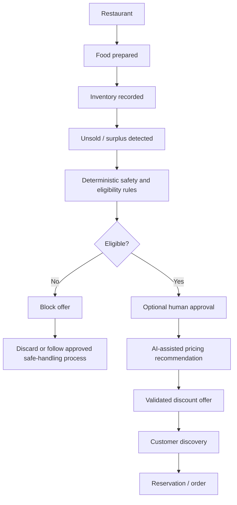
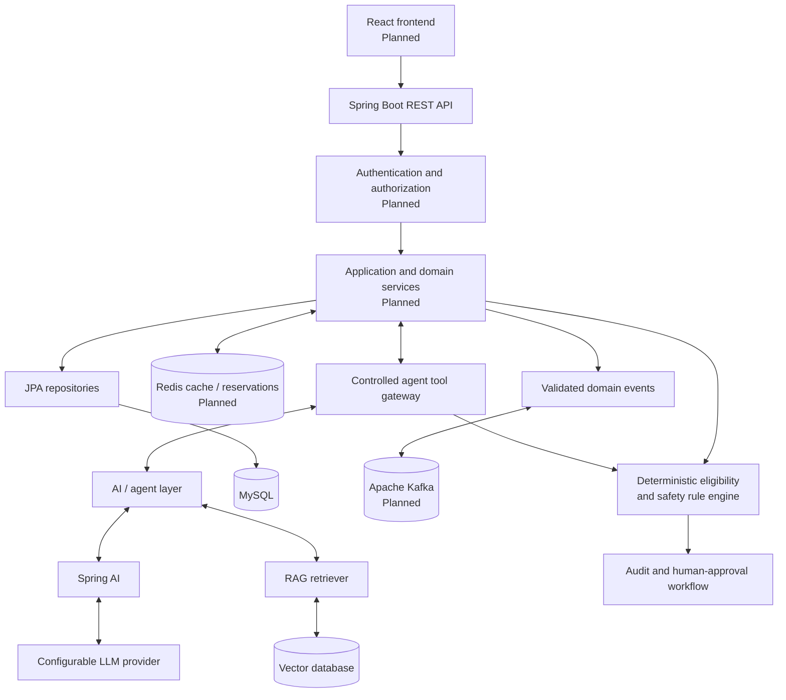
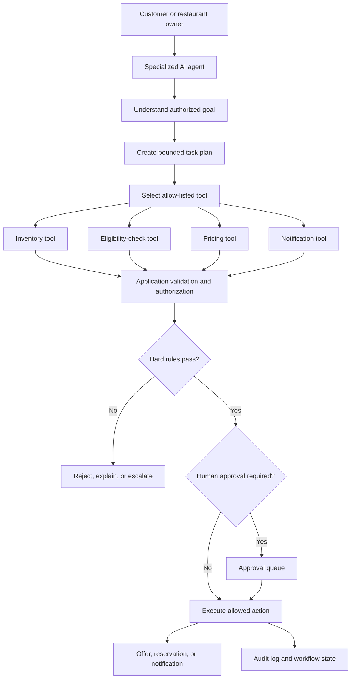
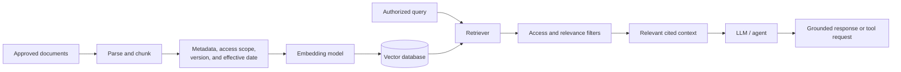
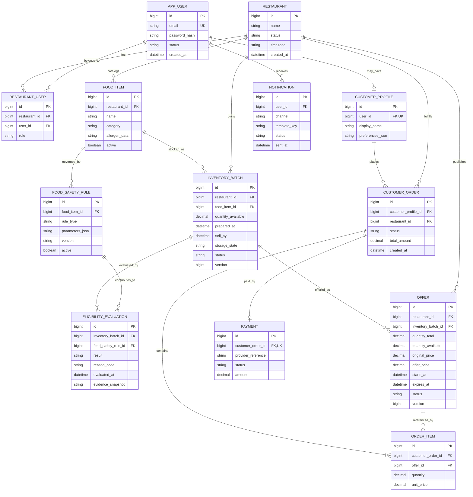

# FoodSaver AI

**Agentic AI Powered Surplus Food Management Platform**

FoodSaver AI is an early-stage platform for helping food businesses reduce avoidable waste by turning eligible surplus inventory into discounted customer offers. The repository currently contains the initial Spring Boot backend scaffold; the marketplace, safety rule engine, frontend, and AI capabilities described below are planned unless explicitly marked **Current**.

> [!IMPORTANT]
> **SURPLUS FOOD != UNSAFE FOOD**
>
> Unsold food may become an offer only after it passes deterministic, configured eligibility and food-safety rules. AI can recommend and coordinate actions, but it is never the final authority for food safety and can never override a failed hard constraint.

## Project Overview

Restaurants, bakeries, sweet shops, cafés, and similar businesses often prepare food before exact demand is known. FoodSaver AI is intended to help these businesses track inventory, identify food that remains unsold, evaluate whether it is still eligible for sale, and publish time-limited discounted offers.

The platform is designed for:

- **Food businesses**, which can manage products, inventory, surplus, offers, and orders while learning from demand.
- **Customers**, who can discover and reserve discounted food that has passed the platform's configured eligibility checks.
- **Operators and authorized staff**, who configure policies, review exceptional cases, and retain control over safety-sensitive decisions.

AI agents are planned to assist with pricing recommendations, demand forecasting, customer recommendations, notifications, and workflow orchestration. They will operate through controlled application tools and validated APIs—not direct database access.

## Problem Statement

Food businesses prepare products daily, but actual demand varies with time, weather, events, location, and customer behavior. Near the end of a selling period, this can produce unsold inventory. Discarding all remaining food creates avoidable waste and revenue loss, while customers miss an opportunity to purchase suitable food at a lower price.

The opportunity is not to sell every unsold item. It is to identify the subset that remains within its configured storage, handling, quality, and selling constraints; receive any required human approval; and make only that eligible surplus available as a discounted offer. Items that fail a rule, have incomplete evidence, or require disposal must never enter the marketplace.

## Solution

FoodSaver AI will connect inventory tracking, deterministic eligibility evaluation, offer creation, ordering, and decision-support agents in a controlled workflow.



The eligibility decision is enforced by application rules. AI may gather facts, explain results, and recommend a price, but it cannot change a failed result into an eligible one.

## Implementation Status

### Current

- Git repository with a GitHub remote.
- Java 21 selection in `backend/.java-version`.
- Spring Boot 4.1.1 backend scaffold.
- Maven Wrapper configured for Maven 3.9.16.
- Spring Web MVC, Validation, Spring Data JPA, Actuator, Lombok, and the MySQL driver configured in Maven.
- Application name, port `8040`, MySQL connection settings, and basic JPA settings.
- A Spring context smoke test.

### Planned

- All restaurant, customer, inventory, offer, order, safety-rule, security, AI, Redis, Kafka, RAG, API documentation, containerization, and frontend functionality.
- Domain entities, database migrations, REST controllers, business services, and production tests.

## Key Features

No domain feature below is implemented yet; these are planned capabilities.

### Restaurant — Planned

- Restaurant registration and authenticated account management.
- Restaurant profile, location, operating hours, and policy configuration.
- Food/product catalog management.
- Batch-aware inventory and quantity management.
- Surplus detection based on inventory and selling periods.
- Discount offer creation, publication, expiration, and withdrawal.
- Reservation and order management.
- Sales, waste, and offer history.

### Customer — Planned

- Customer registration and login.
- Browse only eligible, active surplus offers.
- Search and filtering by product, category, price, dietary attributes, and time.
- Discover nearby offers using geolocation.
- Personalized recommendations.
- Reserve or order available quantities.
- View order and reservation history.

### AI — Planned

- Pricing recommendations within configured discount and safety constraints.
- Demand prediction to reduce over-preparation.
- Customer offer recommendations.
- Notification timing and audience recommendations.
- Agentic workflow orchestration with explicit state and approvals.
- Validated tool calling through application services.
- Retrieval-augmented generation (RAG) over approved knowledge sources.
- Specialized multi-agent collaboration.

### Safety — Planned

- Deterministic eligibility rule engine.
- Product- and storage-specific safe selling windows.
- Hard constraints that cannot be bypassed by an AI agent.
- Complete reason codes and audit records for eligibility decisions.
- Human or qualified oversight where policy or regulation requires it.
- Fail-closed behavior when required safety data is missing or invalid.

## Tech Stack

| Layer | Technology | Repository status |
| --- | --- | --- |
| Frontend | React | **Planned**; `frontend/` is currently empty |
| Backend | Java + Spring Boot 4.1.1 | **Current scaffold** |
| REST | Spring Web MVC | **Configured**, no controllers yet |
| Persistence | Spring Data JPA | **Configured**, no entities/repositories yet |
| Database | MySQL | **Driver and connection configured**, no schema/migrations yet |
| Validation | Jakarta Validation via Spring Boot | **Configured** |
| Operations | Spring Boot Actuator | **Configured** |
| Security | Spring Security + JWT | **Planned** |
| Cache | Redis | **Planned** |
| Messaging | Apache Kafka | **Planned** |
| AI framework | Spring AI | **Planned** |
| LLM | Configurable provider | **Planned** |
| RAG | Provider-neutral vector database | **Planned** |
| Containerization | Docker | **Planned** |
| Build tool | Maven Wrapper 3.9.16 | **Current** |
| Java | Java 21 | **Current** |
| API documentation | Swagger / OpenAPI | **Planned** |
| Version control | Git + GitHub | **Current** |

## Architecture

The target architecture separates deterministic business authority from probabilistic AI assistance.



The LLM must not issue SQL or mutate persistence directly. An agent requests an action through a narrowly scoped tool; the application authenticates the actor, validates the input, checks authorization and current state, executes hard rules, applies transaction and concurrency controls, and records the result.

## Agentic AI Architecture

FoodSaver AI is intended to be more than a chatbot. An LLM produces language and reasoning-like outputs; an **agent** combines a model with a goal, tools, workflow state, retrieval, policy constraints, and controlled execution.

- **LLM:** Interprets requests and generates recommendations or structured tool arguments.
- **Agent:** Coordinates a bounded task and maintains its execution state.
- **Tools:** Typed application capabilities exposed to an agent, such as checking eligibility or requesting offer creation.
- **Planning:** Breaks an allowed goal into auditable steps.
- **Decision support:** Selects recommendations within limits; authoritative rule outcomes remain deterministic.
- **Workflow execution:** Invokes validated tools and handles success, rejection, retries, and escalation.
- **Memory/state:** Stores only appropriate task context, with retention and privacy controls.
- **RAG:** Retrieves approved context relevant to the current task.
- **Guardrails:** Restrict tools, validate schemas, filter data, enforce limits, and stop prohibited actions.
- **Human approval:** Gates safety-sensitive, high-impact, low-confidence, or policy-defined actions.



Deterministic rules remain outside the LLM's authority because model responses are probabilistic, can be incomplete, and may be affected by ambiguous or untrusted context. Tool output and rule decisions—not generated prose—control whether an action is permitted.

## Planned Agents

### Food Safety / Eligibility Agent

- **Responsibility:** Coordinate collection of batch, preparation, storage, handling, time, and policy facts; request an authoritative rule evaluation; explain the returned result.
- **Inputs:** Food item and batch identifiers, timestamps, storage history, handling evidence, restaurant policy, and actor context.
- **Tools:** `getFoodItem()`, `getRestaurantInventory()`, `checkFoodEligibility()`, and a human-review request tool.
- **Outputs:** Rule-engine result, reason codes, missing-information requests, and escalation status.
- **Must not:** Decide safety from model judgment, invent missing facts, weaken thresholds, or override an ineligible result.

### Pricing Agent

- **Responsibility:** Recommend a discount for an already eligible item within configured pricing boundaries.
- **Inputs:** Remaining eligible selling window, quantity, base price, demand signal, historical sales, active offers, and pricing policy.
- **Tools:** `getCurrentOffers()`, `getDemandPrediction()`, and `calculateRecommendedDiscount()`.
- **Outputs:** Recommended price or discount, rationale, confidence, and applicable validity period.
- **Must not:** Change eligibility, recommend a prohibited price, publish without required approval, or extend a selling window.

### Demand Prediction Agent

- **Responsibility:** Analyze historical patterns and produce decision support for future preparation quantities.
- **Inputs:** Historical sales, waste, time, seasonality, promotions, events, and available external signals.
- **Tools:** Historical analytics queries and `getDemandPrediction()`.
- **Outputs:** Forecast ranges, confidence, relevant factors, and suggested preparation levels.
- **Must not:** Treat forecasts as certainty, autonomously alter safety policy, or use unauthorized personal data.

### Customer Recommendation Agent

- **Responsibility:** Rank currently eligible offers for a customer.
- **Inputs:** Active offers, consented preferences, dietary filters, budget, location, and prior interactions where permitted.
- **Tools:** `getCurrentOffers()` and recommendation/ranking services.
- **Outputs:** Ranked eligible offers with concise reasons.
- **Must not:** Recommend expired, unavailable, ineligible, or incompatible items; expose another user's data; or make unsupported health claims.

### Notification Agent

- **Responsibility:** Select appropriate recipients, channels, and timing for offer and order notifications.
- **Inputs:** Eligible active offers, notification preferences, consent, location, order state, and frequency limits.
- **Tools:** `getCurrentOffers()` and `sendNotification()`.
- **Outputs:** Validated notification requests and delivery status.
- **Must not:** Spam users, bypass consent or quiet-hour policies, reveal sensitive data, or advertise an ineligible/expired offer.

## Tool Calling

Planned agent tools may include:

```text
getRestaurantInventory()
getFoodItem()
checkFoodEligibility()
getCurrentOffers()
calculateRecommendedDiscount()
getDemandPrediction()
createOffer()
reserveFood()
createOrder()
sendNotification()
```

Every tool should have a narrow purpose, a versioned input/output schema, authentication and authorization checks, input validation, timeouts, observability, and idempotency where retries are possible. Mutating tools must re-check current state and hard business rules inside the transaction. For example, `createOffer()` must independently verify eligibility even if an agent previously called `checkFoodEligibility()`.

The LLM must never receive general-purpose SQL, shell, or unrestricted HTTP tools for production workflows. Database writes belong behind application services and repositories with validation and audit logging.

## RAG Architecture

RAG is planned to ground explanations and recommendations in approved, current documents such as:

- Food-handling guidelines.
- Restaurant standard operating procedures (SOPs).
- Product and allergen information.
- Storage and handling procedures.
- Internal operational policies.
- Applicable regulations and policy guidance.



Ingestion should preserve source, version, jurisdiction, effective date, and access-control metadata. Retrieval results should be treated as untrusted context, protected against prompt injection, and cited where practical.

> **RAG provides contextual information and does not replace deterministic food-safety rules or qualified oversight.**

## Database Design

### Current Schema

There are currently no JPA entities, repositories, migration files, or application-owned tables in the repository. The configured `spring.jpa.hibernate.ddl-auto=update` setting has therefore not been treated as a production schema definition.

### Proposed Future Schema

The following ER model is a proposal for planning and discussion, not an implemented or final schema. A production design should use versioned migrations and confirm data types, constraints, retention, privacy, payments, and jurisdiction-specific requirements.



`INVENTORY_BATCH` is modeled separately from `FOOD_ITEM` because preparation time, storage history, available quantity, and eligibility apply to a specific batch. `ELIGIBILITY_EVALUATION` preserves the rule version, evidence, result, and reason instead of storing an unexplained AI-generated safety flag. Reservation modeling may later require a dedicated entity with expiry and concurrency controls.

## Project Structure

Current repository structure:

```text
food-saver/
├── .mvn/
│   └── wrapper/
│       └── maven-wrapper.properties
├── backend/
│   ├── .java-version
│   └── food-saver/
│       ├── .mvn/
│       │   └── wrapper/
│       │       └── maven-wrapper.properties
│       ├── src/
│       │   ├── main/
│       │   │   ├── java/
│       │   │   │   └── com/foodsaver/
│       │   │   │       └── FoodSaverApplication.java
│       │   │   └── resources/
│       │   │       └── application.properties
│       │   └── test/
│       │       └── java/
│       │           └── com/foodsaver/
│       │               └── FoodSaverApplicationTests.java
│       ├── .gitattributes
│       ├── .gitignore
│       ├── mvnw
│       ├── mvnw.cmd
│       └── pom.xml
├── frontend/                       # Empty; implementation planned
├── .gitattributes
├── .gitignore
└── README.md
```

- `backend/food-saver/` is the executable Spring Boot Maven project.
- `src/main/java/` contains application code; currently only the bootstrap class exists.
- `src/main/resources/` contains runtime configuration.
- `src/test/` contains tests; currently only a context-load smoke test exists.
- `frontend/` is reserved for the planned React application.
- The root `.mvn/` metadata exists, but the executable Maven Wrapper scripts are inside `backend/food-saver/`; run Maven commands from that directory.

A possible future AI package layout is:

```text
src/main/java/com/foodsaver/ai/
├── agent/       # Agent definitions and orchestration
├── tool/        # Typed, allow-listed application tools
├── prompt/      # Versioned prompt templates
├── rag/         # Ingestion and retrieval
├── memory/      # Scoped workflow state
└── guardrail/   # Policy, validation, and approval gates
```

This package structure is **planned** and does not currently exist.

## Environment Setup

### Prerequisites

- Git.
- Java 21 (the repository contains `backend/.java-version`).
- Maven is optional because the backend includes Maven Wrapper 3.9.16.
- MySQL compatible with the configured MySQL Connector/J and Spring Boot version.
- Node.js and npm for the future React frontend; no frontend version or package scripts are defined yet.

Verify the main tools:

```bash
java -version
git --version
node --version
npm --version
```

Clone and enter the repository:

```bash
git clone https://github.com/AmitKumar1404/food-saver-ai.git
cd food-saver-ai
```

## Backend Setup

From the repository root:

```bash
cd backend/food-saver
```

Build and run all current tests:

```bash
./mvnw clean verify
```

Run the application:

```bash
./mvnw spring-boot:run
```

On Windows, use `mvnw.cmd` instead of `./mvnw`. The application is configured to listen on `http://localhost:8040`.

The current smoke test loads the full Spring context and therefore needs a reachable MySQL database matching the runtime configuration. A future test profile or containerized test database should isolate tests from a developer's local database.

## Database Setup

Create a local development database using an appropriately privileged MySQL account:

```sql
CREATE DATABASE food_saver_db
  CHARACTER SET utf8mb4
  COLLATE utf8mb4_unicode_ci;
```

Create a dedicated application user and grant only the permissions needed for local development. Do not use a production account or place its password in the repository.

The current `application.properties` contains hard-coded database credentials. Replace them before sharing or deploying the application:

```properties
spring.datasource.url=${DB_URL:jdbc:mysql://localhost:3306/food_saver_db}
spring.datasource.username=${DB_USERNAME}
spring.datasource.password=${DB_PASSWORD}
```

Then export local values through your shell, IDE run configuration, or a secret manager:

```bash
export DB_URL="jdbc:mysql://localhost:3306/food_saver_db"
export DB_USERNAME="<your-local-database-user>"
export DB_PASSWORD="<your-local-database-password>"
```

No schema migrations exist yet. Before production use, add a migration tool such as Flyway or Liquibase and replace Hibernate's `ddl-auto=update` behavior with migration-controlled schema management.

## Frontend Setup

**Frontend implementation is planned / under development.**

The `frontend/` directory currently contains no `package.json` or source files, so there are no valid install or run commands yet. Once a React application is initialized, document the actual package-manager scripts here; a typical Vite-based workflow would be `npm install` followed by `npm run dev`, but those commands are not currently configured by this repository.

## Configuration

Production configuration should be externalized through environment variables or a managed secret store. The following is a **proposed** configuration shape; only the application name, server port, datasource, and JPA settings currently exist.

```properties
# Current application settings, externalized
spring.application.name=food-saver
server.port=${SERVER_PORT:8040}

spring.datasource.url=${DB_URL}
spring.datasource.username=${DB_USERNAME}
spring.datasource.password=${DB_PASSWORD}

# Planned integrations
spring.data.redis.host=${REDIS_HOST:localhost}
spring.data.redis.port=${REDIS_PORT:6379}
spring.kafka.bootstrap-servers=${KAFKA_BOOTSTRAP_SERVERS:localhost:9092}

# Use a sufficiently strong value provided by a secret manager
app.security.jwt.secret=${JWT_SECRET}
app.security.jwt.expiration=${JWT_EXPIRATION:15m}

# Provider names and property keys should be finalized with Spring AI
app.ai.provider=${LLM_PROVIDER}
app.ai.api-key=${LLM_API_KEY}
app.ai.model=${LLM_MODEL}
app.ai.vector-store.url=${VECTOR_DB_URL}
app.ai.vector-store.api-key=${VECTOR_DB_API_KEY}
```

Property names under `app.security` and `app.ai` are proposed placeholders, not implemented configuration contracts. Never commit the corresponding values.

For production, also configure TLS termination, allowed origins, logging redaction, database pooling, timeouts, migrations, health probes, metrics, tracing, backups, and secret rotation.

## API Documentation

There are currently no controller classes or business API endpoints. Swagger/OpenAPI is not configured.

| Method | Endpoint | Description | Auth |
| --- | --- | --- | --- |
| — | — | Business APIs are under development | — |

Actuator is present as a dependency, but exposed management endpoints and access policy should be explicitly reviewed before deployment. Future APIs should be documented from the implemented controllers rather than invented in advance.

## Event-Driven Architecture

Kafka integration is **planned** and is not present in the Maven configuration or source code.

Candidate domain events include:

```text
FoodPrepared
FoodInventoryUpdated
FoodSurplusDetected
OfferCreated
FoodReserved
OrderCreated
FoodSold
OfferExpired
FoodMarkedUnsafe
```

Application services should produce events only after successful state transitions, ideally using a transactional outbox to avoid database/event inconsistency. Consumers may update search views, caches, analytics, demand models, and notifications. Events need stable schemas, unique IDs, timestamps, aggregate versions, correlation IDs, idempotent consumers, retries, and dead-letter handling. Safety-critical state must remain authoritative in the transactional business system; delayed events must not reactivate expired or ineligible food.

## Redis Usage

Redis integration is **planned**. Appropriate use cases may include:

- Cached inventory read models with careful invalidation.
- Geospatial indexes for nearby eligible offers.
- Short-lived offer availability views.
- Reservation holds with atomic expiry and database reconciliation.
- Rate limits and idempotency keys.
- Scoped, short-lived agent workflow state where appropriate.

Redis must not become the sole source of truth for eligibility, orders, payments, or durable inventory. Cache entries need TTLs and must be revalidated against authoritative state before a purchase or offer mutation.

## Development Roadmap

- [x] **Phase 1 — Initial project setup:** Git repository, Java 21, Spring Boot scaffold, Maven Wrapper, and baseline dependencies.
- [ ] **Phase 2 — Restaurant management**
- [ ] **Phase 3 — Food/product management**
- [ ] **Phase 4 — Inventory management**
- [ ] **Phase 5 — Surplus food detection**
- [ ] **Phase 6 — Food-safety rule engine**
- [ ] **Phase 7 — Discount marketplace**
- [ ] **Phase 8 — Customer ordering**
- [ ] **Phase 9 — AI fundamentals**
- [ ] **Phase 10 — Controlled tool calling**
- [ ] **Phase 11 — FoodSaver AI agent**
- [ ] **Phase 12 — RAG**
- [ ] **Phase 13 — Multi-agent architecture**
- [ ] **Phase 14 — Kafka and Redis integration**
- [ ] **Phase 15 — Human approval and guardrails**
- [ ] **Phase 16 — Docker and productionization**

The order may change as requirements, regulatory review, and risk analysis evolve. Security, testing, auditability, and safety controls should be developed throughout—not deferred to the final phases.

## Git Workflow

For a small change:

```bash
git status
git add .
git commit -m "Add restaurant module"
git push
```

For normal feature development, branch from an up-to-date `main`:

```bash
git switch main
git pull
git switch -c feature/restaurant-management

# Implement and test the feature

git add .
git commit -m "Add restaurant management"
git push -u origin feature/restaurant-management
```

```text
development work
       ↓
feature/restaurant-management
       ↓
pull request and review
       ↓
main
```

Keep commits focused, do not commit generated build output or secrets, and use a pull request when review or CI is available.

## Security

- Never commit passwords, API keys, access tokens, private keys, or JWT secrets.
- Replace the credentials currently hard-coded in `application.properties` with environment-variable or secret-manager references.
- Use `.env` only for local development and keep it ignored; commit an `.env.example` containing names and safe placeholders if needed.
- Use password hashing designed for credentials; never store plaintext passwords.
- Authenticate users and authorize every sensitive resource and operation.
- Validate and normalize all API and agent-tool inputs.
- Give each tool and service account least privilege.
- Re-check authorization and mutable business state when an action executes.
- Protect against overbooking with transactions, locking/versioning, idempotency, and reservation expiry.
- Rate-limit authentication, ordering, notifications, and AI/tool endpoints.
- Redact credentials and sensitive personal data from logs, prompts, traces, and model-provider requests.
- Treat retrieved documents, user prompts, and model output as untrusted input.
- Record auditable actor, decision, rule version, tool invocation, approval, and outcome data.
- Review Actuator exposure and protect non-public management endpoints.
- Use dependency scanning, secret scanning, tests, and code review in CI.

## Food Safety and AI Guardrails

Food safety is an application invariant, not a prompt instruction.

1. **AI recommendations are not authoritative food-safety decisions.** A model can help collect information or explain a result, but the configured rule engine and required qualified oversight determine whether an item may proceed.
2. **Hard safety and business rules must be deterministic.** Time windows, storage constraints, mandatory evidence, blocked categories, recall status, and other enforceable policies belong in versioned application logic and data.
3. **AI cannot override a failed check.** Mutating tools must reject prohibited actions even when an LLM requests them.
4. **Unsafe, expired, recalled, unverifiable, or otherwise ineligible food must never be offered because a model recommends it.** Missing required data should fail closed or enter a defined review workflow.
5. **Human or qualified oversight may be required.** Approval requirements depend on operating procedures, risk classification, and applicable law; the system must support escalation and record the decision.
6. **RAG is context, not permission.** Retrieved text may be outdated, jurisdictionally irrelevant, incomplete, or maliciously altered. It cannot bypass executable rules.

Additional engineering controls should include immutable evaluation evidence, policy/rule versioning, reason codes, offer expiry no later than the eligible window, clock and timezone consistency, recall/withdrawal capability, audit logging, monitoring, and incident procedures. Regulatory and food-safety requirements must be reviewed by appropriately qualified professionals for every deployment location.

## Future Enhancements

Potential future work includes:

- Advanced probabilistic demand forecasting with uncertainty intervals.
- Constraint-aware dynamic pricing.
- Geolocation and route-aware nearby discovery.
- Better privacy-preserving customer recommendations.
- Multi-agent orchestration with explicit handoffs.
- Hybrid search, reranking, citations, and evaluation for RAG.
- Metrics, traces, alerting, model/tool observability, and quality evaluation.
- Tamper-evident audit logging and policy-version history.
- Risk-based human approval workflows.
- Fraud, abuse, and account-takeover prevention.
- Payment-provider integration.
- Pickup and delivery-provider integration.
- Restaurant waste, revenue, and demand analytics dashboards.
- Accessibility, localization, and multi-timezone support.

All items in this section are **future work**.

## Contribution and Development Guidelines

1. Create a focused feature branch from `main`.
2. Implement one cohesive feature or fix.
3. Add or update unit, integration, and rule-boundary tests.
4. Run `./mvnw clean verify` from `backend/food-saver/` and run frontend checks once the frontend exists.
5. Confirm that no credentials, private data, generated output, or local configuration will be committed.
6. Commit with a clear, meaningful message.
7. Push the branch and create a pull request when appropriate.
8. Document behavior and configuration changes, especially safety rules and agent tools.

Changes to eligibility rules, authorization, pricing constraints, agent tools, or approval workflows should receive additional review and include tests for both permitted and rejected paths.

## License

License: To be decided.
